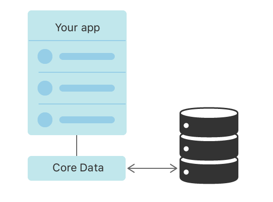
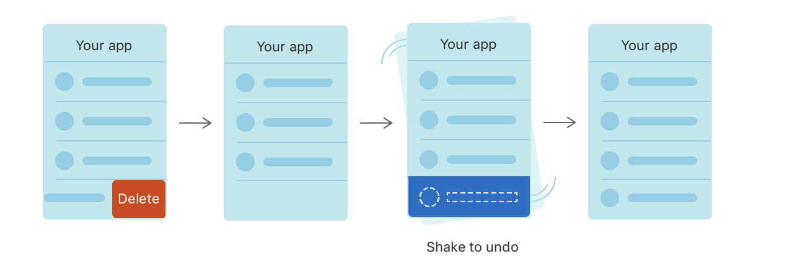

#  Core Data Example

## Overview
`Core Data` is the modern persistence framework for Apple platforms development. By using this framework, you can get more power than using `Sqllite` or other tools. You can not only persist or cache data in a single device, but also sync data to muiltiple devices with `CloudKit`.

`Core Data` has many utilities that can match `SwiftUI` pretty well, such as Persistance, Undo/Redo, Background Data Task, Synchronization and Versioning & Migration.

